# PyTorch Ultrasound Simulator (`torchsimus`)

`torchsimus` es un simulador de ultrasonido de alta precisión orientado a PyTorch.

## Unidades (Sistema Internacional)
Todas las magnitudes internas del simulador se expresan estrictamente en unidades del SI:
* **Posiciones espaciales ($x, y, z$):** Metros ($\mathrm{m}$)
* **Tiempo ($t$):** Segundos ($\mathrm{s}$)
* **Frecuencia ($f$):** Hertz ($\mathrm{Hz}$)
* **Velocidad del sonido ($c$):** Metros por segundo ($\mathrm{m/s}$)

## Dimensiones y Convenciones de Tensores
El framework opera estructurando los tensores principales de la siguiente manera:
* `scatterer_positions`: $[S, 3]$ (o $[B, S, 3]$ en modo batch)
* `reflectivity`: $[S]$ (o $[B, S]$)
* `element_centers`: $[N, 3]$
* `element_frames`: $[N, 3, 3]$
* `tx_delays`: $[E, N]$ (o $[B, E, N]$)
* `tx_apodization`: $[E, N]$ (o $[B, E, N]$)
* `frequencies`: $[F]$
* `spectrum`: $[F, N_{rx}, E]$
* `RF`: $[N_t, N_{rx}, E]$ (o $[B, N_t, E, N]$)

## Convención de Fourier
Las ecuaciones analíticas internas emplean la dependencia temporal $e^{-i\omega t}$ y la propagación $e^{+ikr}$. Dado que la FFT estándar de PyTorch difiere en signo, se debe aplicar explícitamente la conversión de conjugado antes de ejecutar `irfft()`:

```python
def physical_to_torch_spectrum(x):
    return x.conj()
```

## Instalación

```bash
pip install torchsimus-0.1.0-py3-none-any.whl   # desde el wheel generado
pip install -e /ruta/a/torchsimus                 # desde el código fuente (modo desarrollo)
```

```python
from torchsimus.probes import get_probe
from torchsimus.field import pfield
```
## Flujo de datos

```mermaid
flowchart LR
    User[Usuario]
    get_probe[get_probe]
    genscat[genscat]
    txdelay[txdelay_focus / plane / diverging]
    geometry[geometry/: LinearArray, ConvexArray, MatrixArray]
    elements[elements/: RectangularElement]
    Transducer[Transducer]
    scat[("scatterers [S,3] + RC")]
    delays[("tx_delays [E,N]")]
    RF[("RF [Nt,N]")]
    IQ[("IQ")]
    bIQ[("IQ beamformado")]
    simus[simus / simus3]
    Simus[Simus nn.Module]
    pfield[pfield / pfield3]
    physics[physics/ + spectra.py + pulse.py]
    tgc[tgc]
    rf2iq[rf2iq]
    das[das / das3]
    bmode[bmode]
    doppler[iq2doppler]
    sptrack[sptrack]
    viz[visualization.py]
    movie[mkmovie]
    User --> get_probe
    User --> genscat
    User --> txdelay
    get_probe --> Transducer
    geometry -.-> Transducer
    elements -.-> Transducer
    genscat --> scat
    Transducer --> txdelay
    txdelay --> delays
    Transducer --> simus
    scat --> simus
    delays --> simus
    Transducer -- batch / gradientes --> Simus
    scat --> Simus
    delays --> Simus
    Transducer --> pfield
    delays --> pfield
    physics -. física completa MUST .-> simus
    physics -. modelo 2-D rápido .-> Simus
    physics -.-> pfield
    simus --> RF
    Simus --> RF
    RF -- opcional --> tgc
    tgc --> RF
    RF -- demodulación --> rf2iq
    rf2iq --> IQ
    IQ -- delay-and-sum --> das
    das --> bIQ
    bIQ --> bmode
    bIQ --> doppler
    bmode -- speckle tracking --> sptrack
    bmode --> viz
    doppler --> viz
    pfield --> viz
    pfield -- animación --> movie
    classDef config fill:#CECBF6,stroke:#534AB7,color:#26215C,stroke-width:1.5px
    classDef interno fill:#F1EFE8,stroke:#888780,color:#444441,stroke-dasharray:4 3
    classDef datos fill:#9FE1CB,stroke:#0F6E56,color:#04342C,stroke-width:1.5px
    classDef sim fill:#FAC775,stroke:#854F0B,color:#412402,stroke-width:1.5px
    classDef proc fill:#B5D4F4,stroke:#185FA5,color:#042C53,stroke-width:1.5px
    classDef salida fill:#F4C0D1,stroke:#993556,color:#4B1528,stroke-width:1.5px
    class User,get_probe,genscat,txdelay,Transducer config
    class geometry,elements,physics interno
    class scat,delays,RF,IQ,bIQ datos
    class simus,Simus,pfield sim
    class tgc,rf2iq,das,bmode,doppler,sptrack proc
    class viz,movie salida
```


